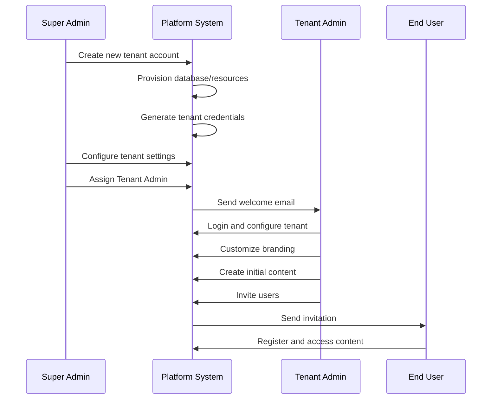

# Multi-Tenant Role-Based Access Control System

## Overview

This document outlines the comprehensive role-based access control (RBAC) architecture for a multi-tenant platform. The system implements a hierarchical permission model with three distinct user roles, each designed to maintain security, operational efficiency, and proper separation of concerns.

---

## Role Hierarchy

```
┌─────────────────────────────────────┐
│         SUPER ADMIN                 │
│   (Platform-Level Management)       │
└─────────────────┬───────────────────┘
                  │
        ┌─────────┴──────────┐
        │                    │
┌───────▼────────┐  ┌────────▼───────┐
│   TENANT A     │  │   TENANT B     │
│                │  │                │
│  ┌──────────┐  │  │  ┌──────────┐  │
│  │ TENANT   │  │  │  │ TENANT   │  │
│  │  ADMIN   │  │  │  │  ADMIN   │  │
│  └────┬─────┘  │  │  └────┬─────┘  │
│       │        │  │       │        │
│  ┌────▼─────┐  │  │  ┌────▼─────┐  │
│  │  USERS   │  │  │  │  USERS   │  │
│  └──────────┘  │  │  └──────────┘  │
└────────────────┘  └────────────────┘
```

---

## Role Definitions

### 1. Super Admin

**Level:** Platform/System Level  
**Scope:** Global access across all tenants  
**Primary Responsibility:** Platform governance and tenant lifecycle management

#### Core Capabilities

##### Tenant Management
- **Tenant Onboarding**
  - Create and provision new tenant accounts
  - Configure initial tenant settings and quotas
  - Set up tenant-specific databases and resources
  - Assign tenant identifiers and domains
  - Configure multi-tenant isolation policies

- **Tenant Lifecycle Management**
  - Activate, suspend, or deactivate tenant accounts
  - Upgrade or downgrade tenant subscription tiers
  - Monitor tenant health and resource utilization
  - Manage tenant billing and payment configurations
  - Handle tenant offboarding and data archival

- **Tenant Configuration**
  - Define storage limits and API rate limits
  - Configure tenant-specific feature flags
  - Set up custom domains and SSL certificates
  - Manage tenant branding and white-labeling
  - Configure single sign-on (SSO) integrations

##### Administrative Functions
- **User Management**
  - Assign and revoke Tenant Admin roles
  - Manage cross-tenant user access (if applicable)
  - Reset passwords for any user across any tenant
  - Audit user activities across the platform

- **Platform Operations**
  - Monitor system-wide performance and health
  - Manage platform-wide settings and configurations
  - Deploy updates and maintenance windows
  - Access system logs and audit trails
  - Configure global security policies

- **Analytics & Reporting**
  - View platform-wide analytics and metrics
  - Generate tenant usage reports
  - Monitor compliance and security events
  - Track revenue and subscription metrics

#### Permissions Matrix

| Action | Permission Level |
|--------|------------------|
| Create Tenant | ✅ Full Access |
| Delete Tenant | ✅ Full Access |
| Modify Tenant Settings | ✅ Full Access |
| Access All Tenant Data | ✅ Full Access |
| Manage Billing | ✅ Full Access |
| Configure Platform Settings | ✅ Full Access |
| View System Logs | ✅ Full Access |
| Manage Super Admins | ✅ Full Access |

#### Best Practices
- Implement multi-factor authentication (MFA) mandatory for all Super Admins
- Maintain detailed audit logs of all Super Admin actions
- Limit the number of Super Admin accounts (principle of least privilege)
- Use separate accounts for day-to-day operations vs. critical administrative tasks
- Regularly review and rotate Super Admin credentials

---

### 2. Tenant Admin

**Level:** Tenant/Organization Level  
**Scope:** Full access within assigned tenant  
**Primary Responsibility:** Content management, user administration, and site configuration

#### Core Capabilities

##### Domain & Configuration Management
- **Domain Administration**
  - Configure custom domain settings
  - Manage DNS records and domain verification
  - Set up subdomain structures
  - Configure domain redirects and routing rules
  - Manage SSL/TLS certificates for custom domains

- **Tenant Settings**
  - Customize tenant-level branding (logos, colors, themes)
  - Configure notification preferences and templates
  - Set up integrations with third-party services
  - Manage API keys and webhooks
  - Configure backup and recovery settings

##### Content Management System (CMS)
- **Page Builder & Design**
  - Create, edit, and publish web pages
  - Design page layouts using drag-and-drop page builder
  - Manage templates and reusable components
  - Configure navigation menus and site structure
  - Set up responsive design breakpoints

- **Content Operations**
  - Create and manage content libraries (images, videos, documents)
  - Organize content with categories, tags, and metadata
  - Schedule content publication and expiration
  - Implement content versioning and rollback
  - Manage content workflows and approval processes

- **Media Management**
  - Upload and organize media assets
  - Optimize images and videos for web delivery
  - Create and manage media galleries
  - Configure CDN settings for media delivery
  - Manage media access permissions

##### User & Access Management
- **User Administration**
  - Invite and onboard new users to the tenant
  - Assign roles and permissions to users
  - Deactivate or remove user accounts
  - Manage user profiles and preferences
  - Reset user passwords

- **Access Control**
  - Define custom user roles and permissions (if supported)
  - Configure content access restrictions
  - Set up approval workflows
  - Manage user groups and teams
  - Configure session timeout and security policies

##### Analytics & Insights
- **Tenant Analytics**
  - View content performance metrics
  - Monitor user engagement and activity
  - Track page views, sessions, and conversions
  - Generate custom reports
  - Export analytics data

- **Audit & Compliance**
  - Access tenant-specific audit logs
  - Monitor user activities within the tenant
  - Track content changes and modifications
  - Generate compliance reports

#### Permissions Matrix

| Action | Permission Level |
|--------|------------------|
| Create Tenant | ❌ No Access |
| Manage Tenant Users | ✅ Full Access |
| Create/Edit Content | ✅ Full Access |
| Delete Content | ✅ Full Access |
| Configure Page Builder | ✅ Full Access |
| Manage Domain Settings | ✅ Full Access |
| View Tenant Analytics | ✅ Full Access |
| Access Other Tenants | ❌ No Access |
| Modify Platform Settings | ❌ No Access |

#### Best Practices
- Implement role-based content approval workflows
- Regularly backup content and configurations
- Document custom configurations and integrations
- Train users on content management best practices
- Monitor content performance and optimize accordingly
- Maintain a content calendar and publishing schedule

---

### 3. Users (End Users)

**Level:** Consumer/Viewer Level  
**Scope:** Read-only access to published content  
**Primary Responsibility:** Content consumption and interaction

#### Core Capabilities

##### Content Access
- **Viewing Content**
  - Access published pages and content
  - View articles, blog posts, and resources
  - Watch videos and media content
  - Download permitted files and documents
  - Navigate through site structure

- **Personalization**
  - Customize personal profile settings
  - Save preferences and favorites
  - Manage notification preferences
  - View personalized content recommendations
  - Track personal reading history

##### Interactive Features
- **Engagement**
  - Comment on content (if enabled)
  - Rate and review content
  - Share content on social media
  - Bookmark and save content for later
  - Participate in polls and surveys

- **User Dashboard**
  - Access personal dashboard
  - View activity history
  - Manage saved content
  - Update account information
  - View notifications and alerts

##### Limited Administrative Actions
- **Self-Service**
  - Update own profile information
  - Change password and security settings
  - Manage communication preferences
  - View own activity logs
  - Request account deletion (GDPR compliance)

#### Permissions Matrix

| Action | Permission Level |
|--------|------------------|
| View Published Content | ✅ Full Access |
| Edit Content | ❌ No Access |
| Delete Content | ❌ No Access |
| Access Page Builder | ❌ No Access |
| View Unpublished Content | ❌ No Access |
| Manage Other Users | ❌ No Access |
| Configure Settings | ❌ No Access (except personal) |
| Access Admin Dashboard | ❌ No Access |

#### Best Practices
- Provide clear onboarding experience for new users
- Implement progressive disclosure for advanced features
- Ensure content is accessible and mobile-friendly
- Provide easy-to-use search and navigation
- Implement feedback mechanisms for user input
- Respect user privacy and data protection regulations

---

## Advanced Features

### Role-Based Content Visibility

```
┌─────────────────────────────────────────────┐
│         Content Visibility Levels           │
├─────────────────────────────────────────────┤
│                                             │
│  Public Content                             │
│  ├─ Super Admin: ✅ View/Edit/Delete        │
│  ├─ Tenant Admin: ✅ View/Edit/Delete       │
│  └─ Users: ✅ View Only                     │
│                                             │
│  Draft Content                              │
│  ├─ Super Admin: ✅ View/Edit/Delete        │
│  ├─ Tenant Admin: ✅ View/Edit/Delete       │
│  └─ Users: ❌ No Access                     │
│                                             │
│  Private Content                            │
│  ├─ Super Admin: ✅ View/Edit/Delete        │
│  ├─ Tenant Admin: ✅ View/Edit/Delete       │
│  └─ Users: ⚠️ Access Based on Rules        │
│                                             │
│  System Content                             │
│  ├─ Super Admin: ✅ View/Edit/Delete        │
│  ├─ Tenant Admin: ❌ No Access              │
│  └─ Users: ❌ No Access                     │
└─────────────────────────────────────────────┘
```

### Tenant Isolation Architecture

**Data Isolation Strategies:**

1. **Database-Level Isolation**
   - Separate database per tenant
   - Complete data separation
   - Independent backups and recovery
   - Enhanced security and compliance

2. **Schema-Level Isolation**
   - Shared database, separate schemas
   - Efficient resource utilization
   - Tenant-specific customization
   - Balanced security and performance

3. **Row-Level Isolation**
   - Shared database and schema
   - Tenant ID in every row
   - Maximum resource efficiency
   - Requires careful access control

### Audit Trail System

**Tracked Events:**

| Event Type | Logged Information | Accessible By |
|------------|-------------------|---------------|
| User Login | Timestamp, IP, Device | Super Admin, Tenant Admin |
| Content Creation | User, Timestamp, Content ID | Tenant Admin |
| Content Modification | User, Changes, Timestamp | Tenant Admin |
| Content Deletion | User, Content ID, Timestamp | Super Admin, Tenant Admin |
| Permission Changes | User, Changes, Timestamp | Super Admin, Tenant Admin |
| Tenant Configuration | Admin, Changes, Timestamp | Super Admin |
| Failed Login Attempts | IP, Username, Timestamp | Super Admin, Tenant Admin |

### Security Considerations

#### Authentication & Authorization
- Implement OAuth 2.0 / OpenID Connect
- Enforce strong password policies
- Require MFA for administrative roles
- Use JWT tokens with short expiration
- Implement session management and timeout

#### Data Protection
- Encrypt data at rest using AES-256
- Encrypt data in transit using TLS 1.3
- Implement field-level encryption for sensitive data
- Regular security audits and penetration testing
- GDPR and data residency compliance

#### Access Control
- Implement principle of least privilege
- Use attribute-based access control (ABAC)
- Regular permission audits and reviews
- Automated access revocation on role change
- IP whitelisting for sensitive operations

---

## Workflow Examples

### Example 1: Onboarding a New Tenant



### Example 2: Content Publishing Workflow

```
1. Tenant Admin creates new page in Page Builder
2. Tenant Admin adds content blocks and media
3. Tenant Admin sets page metadata and SEO
4. Tenant Admin saves as draft
5. [Optional] Tenant Admin requests review
6. Tenant Admin previews page
7. Tenant Admin publishes page
8. System indexes content for search
9. Users can now view the published page
10. Tenant Admin monitors page analytics
```

### Example 3: User Access Request

```
1. User requests access to private content
2. System checks user permissions
3. If permitted: Grant access
4. If not permitted: Show access denied message
5. User can request access from Tenant Admin
6. Tenant Admin reviews request
7. Tenant Admin grants/denies access
8. User receives notification of decision
9. Event logged in audit trail
```

---

## API Endpoints by Role

### Super Admin Endpoints

```
POST   /api/v1/tenants                    # Create tenant
GET    /api/v1/tenants                    # List all tenants
GET    /api/v1/tenants/{id}               # Get tenant details
PUT    /api/v1/tenants/{id}               # Update tenant
DELETE /api/v1/tenants/{id}               # Delete tenant
POST   /api/v1/tenants/{id}/suspend       # Suspend tenant
POST   /api/v1/tenants/{id}/activate      # Activate tenant
GET    /api/v1/platform/analytics         # Platform analytics
GET    /api/v1/platform/logs              # System logs
```

### Tenant Admin Endpoints

```
GET    /api/v1/tenant/settings            # Get tenant settings
PUT    /api/v1/tenant/settings            # Update settings
GET    /api/v1/tenant/users               # List tenant users
POST   /api/v1/tenant/users               # Create user
DELETE /api/v1/tenant/users/{id}          # Remove user
GET    /api/v1/content                    # List content
POST   /api/v1/content                    # Create content
PUT    /api/v1/content/{id}               # Update content
DELETE /api/v1/content/{id}               # Delete content
POST   /api/v1/content/{id}/publish       # Publish content
GET    /api/v1/pages                      # List pages
POST   /api/v1/pages                      # Create page
PUT    /api/v1/pages/{id}                 # Update page
GET    /api/v1/tenant/analytics           # Tenant analytics
```

### User Endpoints

```
GET    /api/v1/content                    # View published content
GET    /api/v1/content/{id}               # View content details
GET    /api/v1/profile                    # Get own profile
PUT    /api/v1/profile                    # Update own profile
GET    /api/v1/bookmarks                  # Get saved items
POST   /api/v1/bookmarks/{id}             # Save item
GET    /api/v1/notifications              # Get notifications
```

---

## Implementation Checklist

### For Super Admins
- [ ] Set up multi-tenant infrastructure
- [ ] Configure tenant isolation mechanisms
- [ ] Implement billing and subscription management
- [ ] Set up monitoring and alerting
- [ ] Create tenant onboarding documentation
- [ ] Establish backup and disaster recovery procedures
- [ ] Configure security policies and MFA
- [ ] Set up audit logging system

### For Tenant Admins
- [ ] Complete tenant configuration
- [ ] Set up custom branding
- [ ] Configure domain and DNS settings
- [ ] Create content templates
- [ ] Set up user roles and permissions
- [ ] Configure integrations
- [ ] Establish content workflow processes
- [ ] Train content creators

### For Users
- [ ] Complete user onboarding
- [ ] Set up user profiles
- [ ] Configure notification preferences
- [ ] Familiarize with platform features
- [ ] Understand content organization
- [ ] Review privacy settings

---

## Compliance & Governance

### Data Protection
- GDPR compliance for EU users
- CCPA compliance for California users
- Data retention policies
- Right to be forgotten implementation
- Data portability features
- Privacy policy and terms of service

### Operational Standards
- ISO 27001 information security
- SOC 2 Type II compliance
- Regular security audits
- Incident response procedures
- Business continuity planning
- Service level agreements (SLAs)

---

## Scalability Considerations

### Performance Optimization
- Content delivery network (CDN) integration
- Database query optimization
- Caching strategies (Redis, Memcached)
- Load balancing across servers
- Asynchronous job processing
- Database read replicas

### Growth Management
- Auto-scaling infrastructure
- Resource monitoring and alerts
- Capacity planning
- Cost optimization strategies
- Multi-region deployment
- Database sharding for large tenants

---

## Support & Resources

### Documentation
- Admin user guides
- API documentation
- Video tutorials
- Best practices guides
- Troubleshooting guides

### Training
- Onboarding webinars
- Role-specific training modules
- Certification programs
- Community forums
- Regular office hours

### Support Channels
- Email support (response SLA based on tier)
- Live chat for urgent issues
- Knowledge base and FAQs
- Dedicated account manager (enterprise)
- Community forums

---

## Version History

| Version | Date | Changes | Author |
|---------|------|---------|--------|
| 1.0.0 | 2025-02-10 | Initial documentation | System Architect |

---

## Contact Information

**For Super Admin Support:**
- Email: superadmin@platform.com
- Emergency: +1-XXX-XXX-XXXX

**For Tenant Admin Support:**
- Email: support@platform.com
- Documentation: https://docs.platform.com

**For End User Support:**
- Help Center: https://help.platform.com
- Community: https://community.platform.com

---

*This document is maintained by the Platform Architecture team and should be reviewed quarterly.*