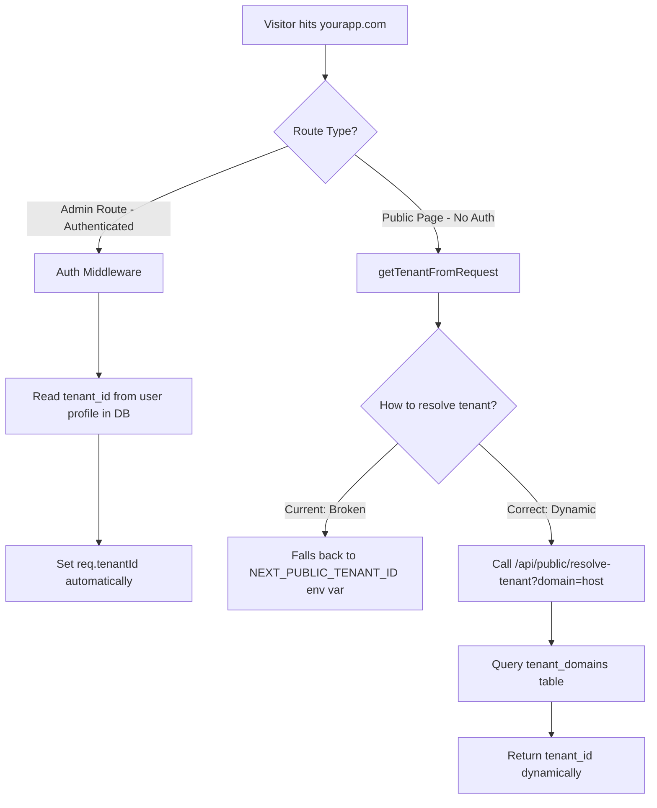
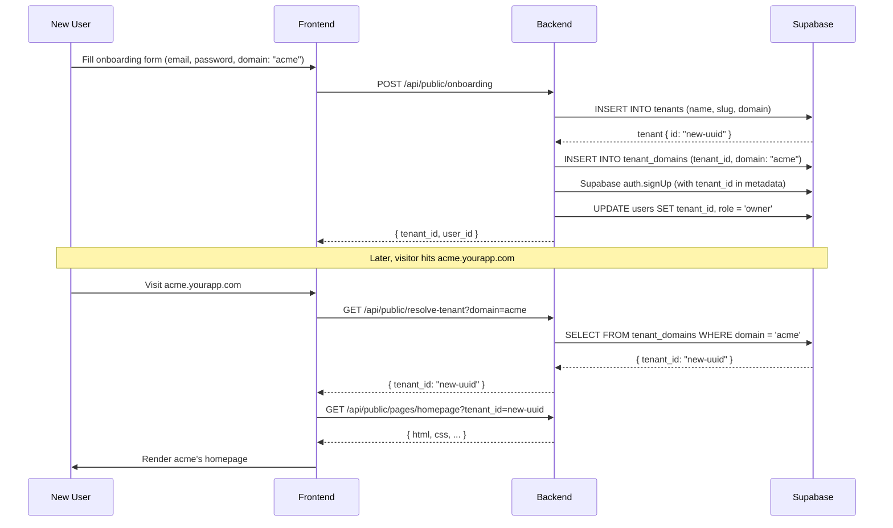

# Dynamic Tenant Resolution Guide

> **TL;DR**: Never hardcode `NEXT_PUBLIC_TENANT_ID` in production. Your backend already supports dynamic resolution via the `resolve-tenant` API and `tenant_domains` table — the frontend just needs to use it.

---

## Why a Static Tenant ID is Wrong

Setting `NEXT_PUBLIC_TENANT_ID=53c58f44-42d4-45d9-b836-30724adfd0d6` in Vercel is a **single-tenant workaround**, not a multi-tenant solution.

| Problem | Impact |
|---|---|
| All visitors see the **same tenant's** content | Defeats the purpose of multi-tenancy |
| `NEXT_PUBLIC_*` vars are **baked into the JS bundle** at build time | Cannot change per-request |
| Adding a new tenant requires **redeploying** | Zero self-service capability |
| Exposes internal UUIDs to the **client** | Minor security concern |

---

## Architecture Overview

Your project already has the infrastructure for dynamic tenant resolution. Here's what exists:



### What Already Works ✅

| Component | File | Status |
|---|---|---|
| `tenant_domains` table | [`006_tenant_domains.sql`](file:///c:/Users/kiran/Code/minimal-saas/supabase/migrations/006_tenant_domains.sql) | ✅ Deployed |
| `resolve-tenant` API endpoint | [`tenant.routes.ts`](file:///c:/Users/kiran/Code/minimal-saas/backend/src/routes/tenant.routes.ts#L17-L40) | ✅ Working |
| Onboarding creates tenant + domain | [`tenant.routes.ts`](file:///c:/Users/kiran/Code/minimal-saas/backend/src/routes/tenant.routes.ts#L42-L170) | ✅ Working |
| Auth middleware resolves tenant from user | [`auth.middleware.ts`](file:///c:/Users/kiran/Code/minimal-saas/backend/src/middleware/auth.middleware.ts#L38-L47) | ✅ Working |
| `getTenantByDomain()` helper | [`tenant.ts`](file:///c:/Users/kiran/Code/minimal-saas/frontend/src/lib/tenant.ts#L28-L39) | ⚠️ Exists but unused |

### What Needs Fixing ❌

| Component | File | Issue |
|---|---|---|
| `getTenantFromRequest()` in homepage | [`page.tsx`](file:///c:/Users/kiran/Code/minimal-saas/frontend/src/app/page.tsx#L8-L29) | Falls back to static env var |
| `getTenantFromRequest()` in catch-all | [`[...slug]/page.tsx`](file:///c:/Users/kiran/Code/minimal-saas/frontend/src/app/%5B...slug%5D/page.tsx#L26-L50) | Falls back to static env var |
| `getTenantHeader()` in API client | [`api.ts`](file:///c:/Users/kiran/Code/minimal-saas/frontend/src/lib/api.ts#L22-L40) | Falls back to static env var |

---

## Resolution Strategy: Subdomain → Domain Lookup → Tenant ID

There are 3 common strategies for multi-tenant routing. Here's what fits your architecture:

### Strategy 1: Subdomain-Based (Recommended)

Each tenant gets a subdomain: `acme.yourapp.com`, `bigcorp.yourapp.com`

```
acme.yourapp.com → resolve-tenant?domain=acme → tenant_id: abc-123
bigcorp.yourapp.com → resolve-tenant?domain=bigcorp → tenant_id: def-456
```

**Pros**: Clean separation, tenant-specific branding, works with Vercel wildcard domains  
**Cons**: Requires wildcard DNS (`*.yourapp.com`) and Vercel wildcard domain config

### Strategy 2: Custom Domain Mapping

Tenants use their own domain: `www.acme.com` → mapped to tenant in `tenant_domains`

```
www.acme.com → resolve-tenant?domain=www.acme.com → tenant_id: abc-123
```

**Pros**: White-label, professional  
**Cons**: Requires DNS verification, more complex setup

### Strategy 3: Path-Based (Not Recommended for SaaS)

`yourapp.com/t/acme/...` — works but feels like a platform, not their own site.

---

## Implementation Plan

### Step 1: Create a Centralized Tenant Resolver

Replace the duplicated `getTenantFromRequest()` functions with a single utility:

```typescript
// frontend/src/lib/resolve-tenant.ts

const API_URL = process.env.NEXT_PUBLIC_API_URL || 'http://localhost:5000/api';

// In-memory cache to avoid hitting the API on every page load
const tenantCache = new Map<string, { tenantId: string; expiresAt: number }>();
const CACHE_TTL = 5 * 60 * 1000; // 5 minutes

export async function resolveTenantFromHost(host: string): Promise<string | null> {
  // 1. Localhost development fallback
  if (host.startsWith('localhost') || host.includes('127.0.0.1')) {
    return process.env.NEXT_PUBLIC_TENANT_ID || null;
  }

  // 2. Extract the domain key (subdomain or full domain)
  const domainKey = extractDomainKey(host);
  if (!domainKey) return null;

  // 3. Check cache first
  const cached = tenantCache.get(domainKey);
  if (cached && cached.expiresAt > Date.now()) {
    return cached.tenantId;
  }

  // 4. Call the resolve-tenant API (which queries tenant_domains table)
  try {
    const res = await fetch(
      `${API_URL}/public/resolve-tenant?domain=${encodeURIComponent(domainKey)}`,
      { cache: 'no-store' }
    );

    if (!res.ok) return null;

    const data = await res.json();
    const tenantId = data.tenant_id;

    // Cache the result
    tenantCache.set(domainKey, {
      tenantId,
      expiresAt: Date.now() + CACHE_TTL,
    });

    return tenantId;
  } catch {
    return null;
  }
}

function extractDomainKey(host: string): string | null {
  // Remove port number
  const hostname = host.split(':')[0];
  const parts = hostname.split('.');

  // Subdomain-based: demo.yourapp.com → "demo"
  if (parts.length >= 3) {
    return parts[0]; // the subdomain
  }

  // Custom domain: www.acme.com → "www.acme.com"
  if (parts.length === 2 || parts.length === 3) {
    return hostname;
  }

  return null;
}
```

### Step 2: Update Frontend Pages to Use Dynamic Resolution

Replace the hardcoded logic in `page.tsx` and `[...slug]/page.tsx`:

```typescript
// Before (broken)
async function getTenantFromRequest() {
  // ...
  return process.env.NEXT_PUBLIC_TENANT_ID || '';  // ← Static!
}

// After (dynamic)
import { resolveTenantFromHost } from '@/lib/resolve-tenant';

async function getTenantFromRequest() {
  const headersList = await headers();
  const host = headersList.get('host') || '';
  return await resolveTenantFromHost(host);
}
```

### Step 3: Ensure Tenant Domains Are Created During Onboarding

This already works! When a tenant onboards via `/api/public/onboarding`, the backend:

1. Creates a row in `tenants` table
2. Creates a row in `tenant_domains` with the chosen domain/subdomain
3. Creates the user with `tenant_id` in their profile

No changes needed here.

### Step 4: Remove `NEXT_PUBLIC_TENANT_ID` from Production

After implementing dynamic resolution:

```diff
# .env.local (development only)
  NEXT_PUBLIC_API_URL=http://localhost:5000/api
- NEXT_PUBLIC_TENANT_ID=53c58f44-42d4-45d9-b836-30724adfd0d6
+ NEXT_PUBLIC_TENANT_ID=53c58f44-42d4-45d9-b836-30724adfd0d6  # Dev only fallback

# Vercel (production)
  NEXT_PUBLIC_API_URL=https://api.yourapp.com/api
- NEXT_PUBLIC_TENANT_ID=53c58f44-42d4-45d9-b836-30724adfd0d6  # ← DELETE THIS
```

### Step 5: Configure Vercel for Wildcard Domains

To support subdomain-based tenancy in production:

1. **Add a wildcard domain** in Vercel Dashboard → Project → Settings → Domains:
   - Add `*.yourapp.com`
   - Vercel will handle SSL for all subdomains automatically

2. **Configure wildcard DNS** at your domain registrar:
   - Add a CNAME record: `*.yourapp.com` → `cname.vercel-dns.com`

3. **For custom domains** (tenants using their own domain):
   - Tenant adds a CNAME pointing to your Vercel deployment
   - You add their domain in Vercel's "Domains" settings
   - Row in `tenant_domains` maps it to their `tenant_id`

---

## Request Flow Summary

### Public Pages (Visitor with no auth)

```
1. Visitor hits → demo.yourapp.com/about
2. Next.js SSR → reads Host header → "demo.yourapp.com"
3. resolveTenantFromHost("demo.yourapp.com")
   → extractDomainKey → "demo"
   → GET /api/public/resolve-tenant?domain=demo
   → Query tenant_domains WHERE domain = 'demo' AND is_active = true
   → Returns { tenant_id: "53c58f44-..." }
4. Fetch page → GET /api/public/pages/about?tenant_id=53c58f44-...
5. Render page HTML
```

### Admin Panel (Authenticated user)

```
1. Admin logs in → Supabase Auth → JWT token
2. Backend auth middleware:
   → Verifies JWT → Gets user from users table
   → user.tenant_id → Set as req.tenantId
3. All API calls automatically scoped to the user's tenant
4. No domain resolution needed — tenant comes from the user profile
```

---

## Tenant Lifecycle



---

## Quick Checklist

- [ ] Create `frontend/src/lib/resolve-tenant.ts` with the centralized resolver
- [ ] Update `frontend/src/app/page.tsx` to use `resolveTenantFromHost()`
- [ ] Update `frontend/src/app/[...slug]/page.tsx` to use `resolveTenantFromHost()`
- [ ] Remove `NEXT_PUBLIC_TENANT_ID` fallback from `api.ts` client (authenticated routes use user profile)
- [ ] Keep `NEXT_PUBLIC_TENANT_ID` in `.env.local` only for local development
- [ ] Remove `NEXT_PUBLIC_TENANT_ID` from Vercel environment variables
- [ ] Configure wildcard domain `*.yourapp.com` in Vercel + DNS
- [ ] Verify onboarding creates `tenant_domains` entries correctly
